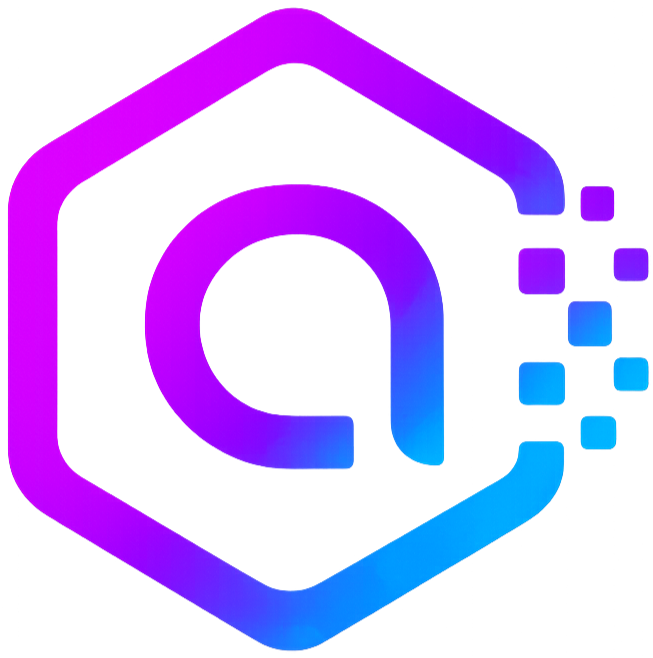

# amatoken



Self-hosted observability for **Claude Code** usage. Reads `~/.claude/projects/**/*.jsonl`,
aggregates tokens and cost by session / project / model, and serves a single-binary
dashboard. Pricing is pulled from **OpenRouter** automatically — no manual price
upkeep required.

<br clear="all"/>

---

## Prerequisites

| Requirement | Minimum | Notes |
|---|---|---|
| Docker Engine | 20.10+ | `docker --version` |
| `git` | any | needed by the installer to clone the repo |
| Claude Code | recent build | the app reads from `~/.claude/projects/`; you need at least one logged session |
| OS | Linux or macOS | Windows: run inside WSL2 |
| Free port | 2002 | configurable at install time or via `AMATOKEN_PORT` |

> `~/.claude/projects` is usually mode `700` — the container must run as your UID/GID.
> The installer and the bundled `docker-compose.yml` already do that for you.

---

## Quick install

One-liner — clones the repo to `~/.amatoken`, builds the image, starts the container,
waits for `/healthz`, and (if interactive) offers to open the dashboard:

```bash
curl -fsSL https://raw.githubusercontent.com/Bedatty-Engineering/amatoken/main/scripts/install.sh | bash
```

Non-interactive (CI / scripted boxes) — accepts defaults silently:

```bash
curl -fsSL https://raw.githubusercontent.com/Bedatty-Engineering/amatoken/main/scripts/install.sh | bash -s -- -y
```

Custom flags — pick a port, branch and install dir:

```bash
curl -fsSL https://raw.githubusercontent.com/Bedatty-Engineering/amatoken/main/scripts/install.sh | bash -s -- -y -p 9090 -b main -d ~/apps/amatoken
```

| Flag | Default | Purpose |
|---|---|---|
| `-y`, `--yes` | off | non-interactive — skip the port prompt and the open-browser confirmation |
| `-p`, `--port PORT` | `2002` (or prompted) | host port to bind |
| `-d`, `--dir DIR` | `~/.amatoken` | clone destination |
| `-b`, `--branch B` | `main` | git ref to check out |

> Re-running the installer is safe: it `fetch`es and resets the existing checkout
> to the requested branch, then rebuilds.

After install:

```bash
curl localhost:2002/healthz             # → ok
xdg-open http://localhost:2002          # or: open http://localhost:2002
```

### Update

Pulls the latest code, rebuilds the image and restarts. Data volume is preserved.

Interactive (shows incoming commits, asks before applying):

```bash
curl -fsSL https://raw.githubusercontent.com/Bedatty-Engineering/amatoken/main/scripts/update.sh | bash
```

Non-interactive:

```bash
curl -fsSL https://raw.githubusercontent.com/Bedatty-Engineering/amatoken/main/scripts/update.sh | bash -s -- -y
```

### Uninstall

Stops the container and removes the image. Asks before deleting the SQLite
volume and the install dir (defaults to keeping both).

Interactive (prompts about volume and install dir):

```bash
curl -fsSL https://raw.githubusercontent.com/Bedatty-Engineering/amatoken/main/scripts/uninstall.sh | bash
```

Keep all data, no prompts:

```bash
curl -fsSL https://raw.githubusercontent.com/Bedatty-Engineering/amatoken/main/scripts/uninstall.sh | bash -s -- -y
```

Nuke everything (volume + install dir), no prompts:

```bash
curl -fsSL https://raw.githubusercontent.com/Bedatty-Engineering/amatoken/main/scripts/uninstall.sh | bash -s -- -y --purge
```

---

## Highlights

- **Dashboard** with cost / sessions / messages / tokens cards, all with **period-over-period delta** (▲ red / ▼ green). Cards are clickable → modal with per-model or per-project breakdown.
- **Stacked daily/hourly chart** with rich hover tooltips. Bars are clickable → modal with per-model breakdown for that day/hour.
- **Top 15 projects** (grouped by `cwd`, not slug) and **top 15 models by spend**, side-by-side. Clicking a row toggles a filter without leaving the page.
- **Tab-scoped filters** — Dashboard and Sessions keep independent filter state.
- **Sessions tab** — paginated table with free-text search across project, branch, model and session id; click any row for a drill-down modal with every assistant message and its individual cost.
- **Multiple named budgets** (calendar-month). Up to 5 pinnable to the dashboard banner.
- **OpenRouter pricing engine** — Anthropic-only models, periodic auto-sync, strict idempotent CRUD.
- **Container resource monitor** in the header — live host CPU %, memory %, Go goroutine count.
- Confirmation modal on every destructive action.

---

## Other ways to run

### Docker Compose (manual)

```bash
git clone https://github.com/Bedatty-Engineering/amatoken.git
cd amatoken
export AMATOKEN_UID=$(id -u) AMATOKEN_GID=$(id -g)
docker compose up --build -d
```

Override the host port without editing the file:

```bash
AMATOKEN_PORT=9090 docker compose up --build -d
```

Day-to-day:

```bash
docker compose logs -f
docker compose restart
docker compose down                 # stop, keep volume
docker compose down -v              # stop and wipe DB
```

### Plain `docker run`

If the Compose v2 plugin isn't available:

```bash
git clone https://github.com/Bedatty-Engineering/amatoken.git
cd amatoken
docker build -t amatoken .
docker volume create amatoken-db

docker run -d --name amatoken \
  --user "$(id -u):$(id -g)" \
  -p 2002:2002 \
  -v "$HOME/.claude/projects:/claude-projects:ro" \
  -v amatoken-db:/data \
  --restart unless-stopped \
  amatoken
```

### Local dev (Go 1.23+)

No Docker, hot-iterate on the code:

```bash
CLAUDE_PROJECTS_DIR=$HOME/.claude/projects \
DB_PATH=./amatoken.db \
  go run ./cmd/server
```

Static assets (HTML/JS/CSS) and migrations are embedded via `go:embed` — `go run`
always reflects the current source.

---

## Configuration

Environment variables (sensible defaults):

| Variable | Default | Purpose |
|---|---|---|
| `CLAUDE_PROJECTS_DIR` | `/claude-projects` | Where the JSONL files live inside the container (set by the volume mount). |
| `DB_PATH` | `/data/amatoken.db` | SQLite file path. |
| `LISTEN_ADDR` | `:2002` | HTTP bind address. |
| `RECONCILE_INTERVAL` | `60s` | Periodic full re-scan in case fsnotify missed an event. |
| `PRICING_SYNC_INTERVAL` | `12h` | OpenRouter auto-sync cadence (only runs while the toggle is on). |
| `AMATOKEN_PORT` | `2002` | Host-side port mapping (read by `docker-compose.yml`). |

In-app settings (persisted in SQLite, editable from the UI):

| Setting | Default | Lives in |
|---|---|---|
| `pricing_auto_sync` | `true` | Toggle in the **Pricing** tab. |
| `auto_refresh_enabled` | `false` | Toggle next to **Refresh now** in the header. |

---

## HTTP API

| Method | Endpoint | Purpose |
|---|---|---|
| GET | `/healthz` | Liveness. |
| GET | `/api/summary?from=&to=&project=&model=` | Tokens + cost USD totals + per-model breakdown. |
| GET | `/api/timeseries?bucket=day\|hour&...` | Time series — tokens AND cost per bucket. |
| GET | `/api/sessions?limit=&offset=&q=&...` | Paginated session list with free-text search. |
| GET | `/api/sessions/{id}/records` | Drill-down: per-message records for one session. |
| GET | `/api/rankings/projects?...` | Per-`cwd` cost / sessions / messages, sorted desc. |
| GET | `/api/rankings/models?...` | Per-model cost, sorted desc. |
| GET | `/api/filters` | Distinct project keys (`cwd` first, falls back to slug) and models for the UI selects. |
| DELETE | `/api/records/{id}` | Remove a single ingested record. |
| GET | `/api/pricing` | List all pricing rows. |
| POST | `/api/pricing` | **Create** a new manual row. Returns **409 Conflict** if the model already exists. |
| PUT | `/api/pricing/{model}` | **Update** an existing row. Returns **404** if the row doesn't exist. Source is preserved. |
| DELETE | `/api/pricing/{model}` | Delete a pricing row. Manual rows are gone for good; OpenRouter rows reappear on the next sync. |
| POST | `/api/pricing/sync` | Force OpenRouter sync now. |
| GET | `/api/pricing/status` | Last sync time, provider, errors, row count. |
| GET / POST / PUT / DELETE | `/api/budgets` | CRUD for budgets (`PUT` accepts `show_in_dashboard`). |
| GET / PUT | `/api/settings` | Key/value app settings — `auto_refresh_enabled`, `pricing_auto_sync`. |
| GET | `/api/resources` | Live container metrics: `cpu_pct_host`, `memory_pct_host`, `memoryMB`, `host_cpu_count`, `host_memory_total_mb`, `goroutines`. |
| POST | `/api/ingest/refresh` | Force a full reconcile of `CLAUDE_PROJECTS_DIR`. |

Quick smoke test:

```bash
curl localhost:2002/healthz
curl localhost:2002/api/summary | jq
curl localhost:2002/api/pricing/status
```

---

## How ingestion works

- Only lines with `type == "assistant"` and a `message.usage` block become rows. `type=user`, `tool_result`, etc. are ignored — they only contribute to the `input_tokens` of the **next** assistant message.
- Synthetic events (`model == "<synthetic>"`) — context compactions, system prompts — are excluded from every aggregation.
- Dedup is by `message.id` (`INSERT OR IGNORE`).
- Per-file byte offset is stored in `ingest_state`; container restarts don't re-ingest.
- `fsnotify` watches every subdir of `CLAUDE_PROJECTS_DIR` (with 500ms debounce). The reconcile tick (default 60s) catches events the watcher missed.

**Project identity = `cwd`, not slug.** Claude Code names project directories after the cwd in which a session *started*, but the cwd inside the JSONL can change as you `cd` around mid-session. amatoken groups by the per-record `cwd` (falling back to project_slug when cwd is missing) so subprojects under the same starting directory show up as distinct rows.

---

## Pricing engine

Implemented as a clean **provider/registry/calculator** trio under `internal/pricing/`.

Three source levels with strict priority:

| `source` | Origin | Sync behaviour |
|---|---|---|
| `manual` | Row added from scratch via the UI (`POST /api/pricing`) | **Never** overwritten by sync. |
| `openrouter` | Pulled from OpenRouter | **Always** refreshed on every sync. Manual edits stay until next sync. |
| `seed` | First-run offline fallback | Replaced as soon as OpenRouter sync succeeds. |

`POST /api/pricing` is **strict** — it refuses to overwrite an existing row (returns `409`). Use `PUT` to edit.

Model-id matching has fallbacks: exact match → strip `-YYYYMMDD` date suffix → walk up `-N` version segments. So `claude-haiku-4-5-20251001` resolves to `claude-haiku-4-5`. OpenRouter's `claude-opus-4.7` is auto-normalised to `claude-opus-4-7`.

---

## Project layout

```
amatoken/
├── cmd/server/main.go          # entrypoint, wiring, graceful shutdown
├── internal/
│   ├── ingest/                 # parser, scanner, fsnotify watcher
│   ├── storage/                # SQLite open + migrations + repo (queries)
│   ├── pricing/                # Provider, OpenRouter, Registry, Calculator
│   ├── seed/                   # First-run example budget + manual pricing
│   └── httpapi/                # chi router, handlers, embedded static UI
├── assets/img/                 # logo, copied into static/ at build time
├── scripts/                    # install.sh, update.sh, uninstall.sh
├── Dockerfile                  # multi-stage: golang:1.23-alpine → alpine:3.20
├── docker-compose.yml
└── README.md
```

Stack: **Go 1.23**, **chi**, **modernc.org/sqlite** (pure Go, no CGO), **fsnotify**.
Frontend: vanilla **Alpine.js** + **Chart.js** via CDN, served as `go:embed` static
files. Final image is ~21 MB.

---

## Troubleshooting

| Symptom | Cause | Fix |
|---|---|---|
| `open db: unable to open database file` | Container UID can't write to `/data`. | Use `--user "$(id -u):$(id -g)"` (already in compose). |
| Dashboard empty despite JSONL existing | Container can't read `~/.claude/projects` (mode 700). | Same fix: run as your host UID. |
| `port is already allocated` | Port 2002 taken. | Re-install with `-p 9090`, or `AMATOKEN_PORT=9090 docker compose up`. |
| `unknown flag: --build` | Compose v2 plugin missing. | `sudo apt install docker-compose-v2`, or use the plain `docker run` flow. |
| New session not appearing | fsnotify missed the create. | Click **Refresh now**, wait up to 60s, or `curl -X POST localhost:2002/api/ingest/refresh`. |
| A model shows `$0.00` cost | No pricing row for that exact id, no fallback matched. | Click **Sync from OpenRouter**, or add the row manually in **Pricing**. |
| OpenRouter sync fails | Rate limit / network blip. | Cached values keep working; the next periodic tick retries. Check `GET /api/pricing/status`. |

---

## Tips on lowering your spend

amatoken is the *measurement* tool — but here's what tends to move the needle:

- **Switch model per task.** Haiku for greps and renames, Sonnet for most coding work, Opus for architecture and tough debugging. The **Top models by spend** panel makes it obvious which model is eating your budget.
- **Start a fresh session for unrelated work.** As context grows, occasional cache writes (priced ~1.25× input) add up. New session = clean cache.
- **Be specific.** Vague prompts trigger exploration; precise file/line references skip it.
- **`Read` with `offset`/`limit`** instead of letting Claude pull whole large files.

---

## License

© 2026 — All rights reserved. Self-hosted Claude usage monitor.
